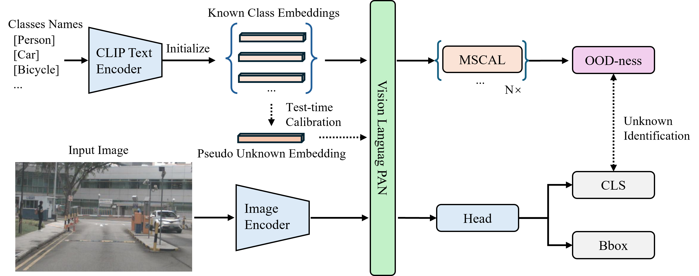

# [BMVC 2025 Oral] From Open Vocabulary to Open World: Teaching Vision Language Models to Detect Novel Objects

<p align="center">
    
</p>

## Environment
- Python 3.11.9 toch 2.3.1 CUDA 12.2
- Install [Yolo World](https://github.com/AILab-CVC/YOLO-World)
  - Requires: mmcv, mmcv-lite, mmdet, mmengine, mmyolo, numpy, opencv-python, openmim, supervision, tokenizers, torch, torchvision, transformers, wheel
- Note: YOLO-World has changed over time. To run our code, you may need to install a previous version of YOLO-World.
- Prepare datasets:
    - M-OWODB and S-OWODB
      - Download [COCO](https://cocodataset.org/#download) and [PASCAL VOC](http://host.robots.ox.ac.uk/pascal/VOC/).
      - Convert annotation format using `coco_to_voc.py`.
      - Move all images to `datasets/JPEGImages` and annotations to `datasets/Annotations`.
    - nu-OWODB
      - For nu-OWODB, first download nuimages from [here](https://www.nuscenes.org/nuimages).
      - Convert annotation format using `nuimages_to_voc.py`.

## Getting Started
- Training open world object detector:
  ```
  sh train.sh
  ```
    - Model training starts from pretrained [Yolo World checkpoint](https://huggingface.co/wondervictor/YOLO-World/blob/main/yolo_world_v2_xl_obj365v1_goldg_cc3mlite_pretrain-5daf1395.pth)
  
- To evaluate the model:
  ```
  sh test_owod.sh
  ```
    - To reproduce our results, please download our checkpoints [here](https://huggingface.co/343GltySprk/ovow/tree/main)


## Citation
If you find this code useful, please consider citing:
```
@misc{li2024openvocabularyopenworld,
      title={From Open Vocabulary to Open World: Teaching Vision Language Models to Detect Novel Objects}, 
      author={Zizhao Li and Zhengkang Xiang and Joseph West and Kourosh Khoshelham},
      year={2024},
      eprint={2411.18207},
      archivePrefix={arXiv},
      primaryClass={cs.CV},
      url={https://arxiv.org/abs/2411.18207}, 
}
```
